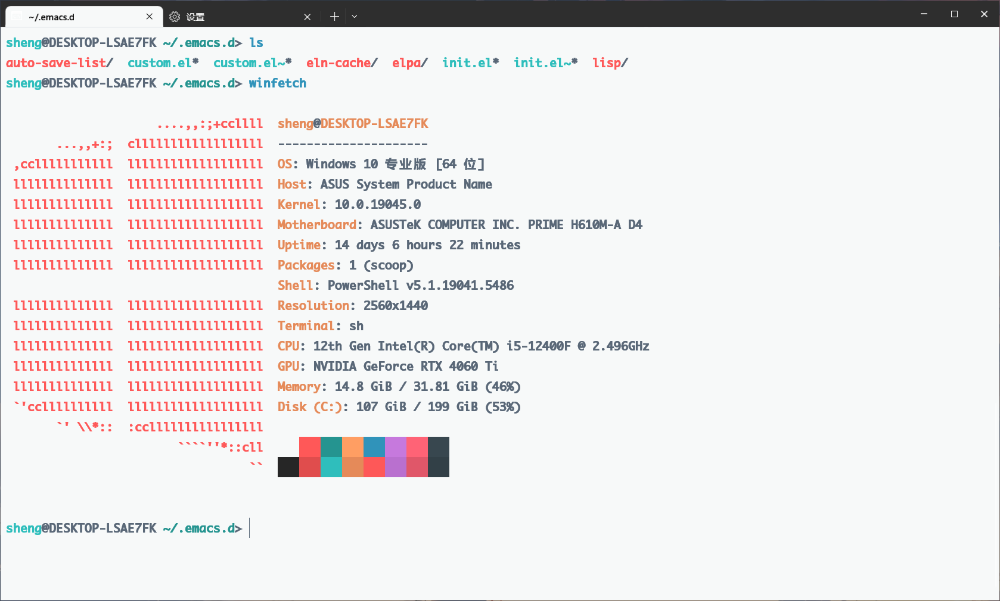
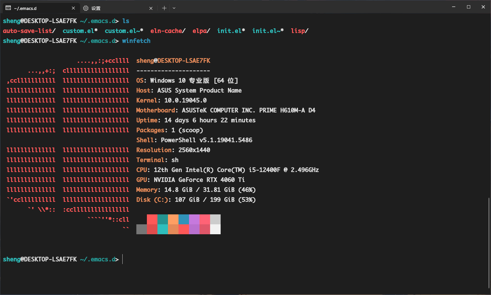

## Moe Theme for [Windows Terminal](https://github.com/Microsoft/Terminal)

## Postscript

Actually, the [Moe theme](https://gitlab.com/jomada/moe-theme) originates from KDE. I personally love this theme and tried to find similar alternatives online, but none were available.
So, I ended up recreating a Windows Terminal-compatible version based on its color scheme.
